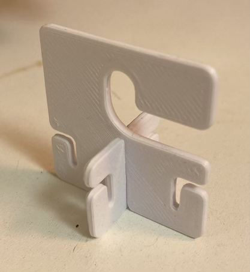
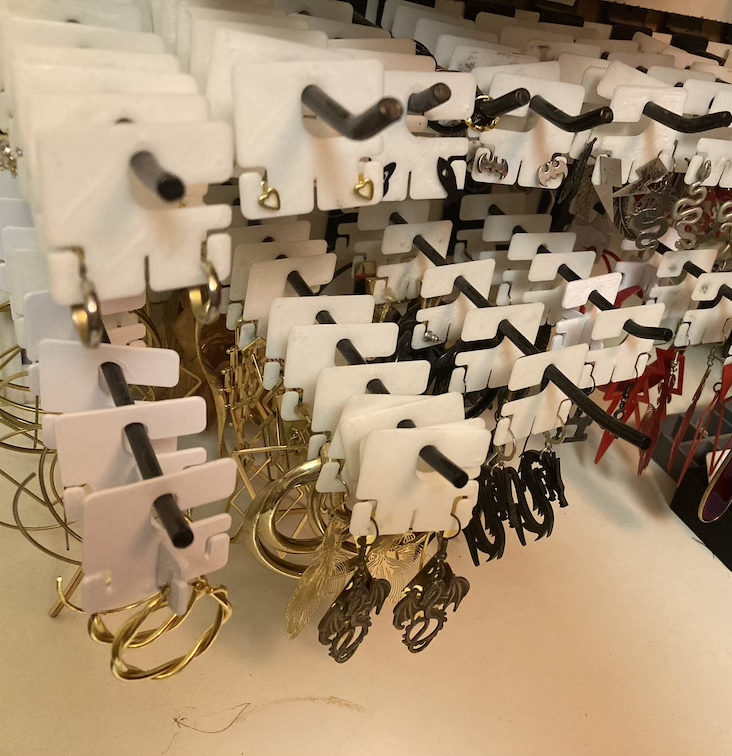

# Earring hanger for slatwalls

On [Thingverse](https://www.thingiverse.com/thing:7052052). On [GitHub](https://github.com/lexblagus/3D-earring-hanger-slatwall).

## Preview

|Part|Usage|Display|
|---|---|---|
||||

## About

Support for earrings on slatwalls. Tested with a lot of earing models!

## Print Settings

| Setting         | Value                        |
|----------------|------------------------------|
| Layer Height    | 0.2 mm |
| Infill          | 20% |
| Supports        | No |
| Material        | PLA |
| Orientation     | Print flat on back face |

## Files Included

- `earring-hanger.stl` – Main model
- `adapter.stl` – To use large ones like hoop earring. Insert in 90° and glue.
- `Earring Hanger.f3d` – Editable Autodesk Fusion 360 parametric source file
- `README.md` – This file
- `LICENSE.txt` – License info (CC BY 4.0)

## License

This work is licensed under the [Creative Commons Attribution 4.0 International (CC BY 4.0)](https://creativecommons.org/licenses/by/4.0/) license.

## Attribution

Designed by [Lexa Blagus](https://blag.us/).  
Published on GitHub/Thingiverse under username `@blagus`.

## Notes

Feel free to remix or adapt — just give credit!
